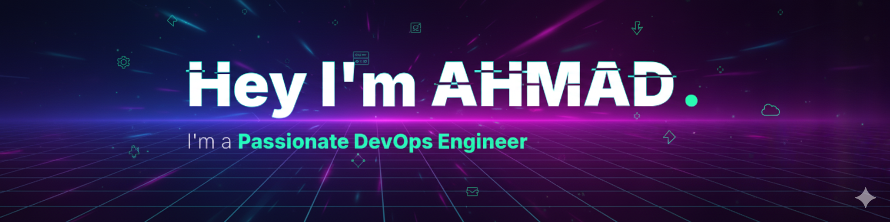
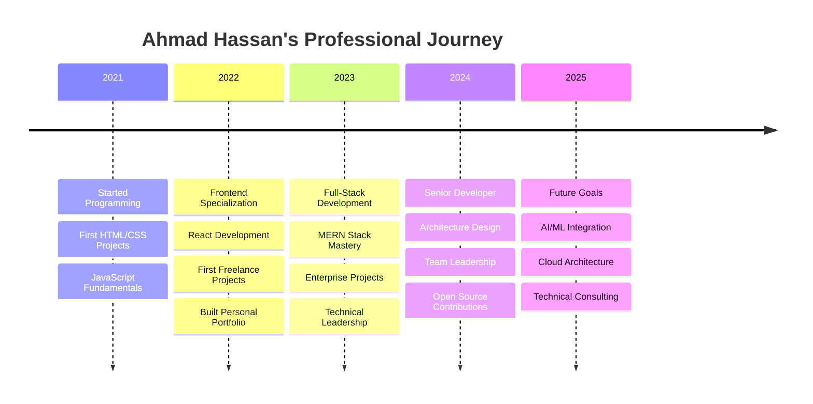

<div align="center">
  <a href="https://ahmadhassanraza.com">
    
  </a>
</div>

<p align="center">
  
</p>

<div align="center">  
  <p>
    
    
    <a href="https://www.linkedin.com/in/yossief-s" target="_blank">
    
  </a>
  </p>
</div>

---

<div align="center">

## 🛠 About

</div>

<!--  -->





``` GO
package main

import (
	"fmt"
)

var (
	isPipelineHealthy   = true
	infraEfficiency     = 85
	isInfrastructureLive = true
)

func debugPipeline() {
	fmt.Println("🔍 Debugging pipeline... checking nodes, pods, and configs.")
}

func monitorMetrics() {
	fmt.Println("📊 Monitoring Pods, Nodes, and Cluster health...")
}

func scalePods() {
	fmt.Println("📦 Scaling Pods dynamically based on traffic needs...")
}

func applyTerraform() {
	fmt.Println("🛠️ Applying Terraform for consistent infrastructure...")
}

func deployServices() {
	fmt.Println("🚢 Deploying services with rolling updates...")
}

func main() {
	// DevOps Life: Automate, Monitor, Optimize 🚀
	if isPipelineHealthy {
		fmt.Println("✨ Build Pipeline is green! Time to optimize Deployment efficiency.")

		// Continuous optimization: because production deserves the best!
		for infraEfficiency < 100 {
			infraEfficiency++
			fmt.Printf("Enhancing... Infra efficiency now at %d%% 🌐📈\n", infraEfficiency)
		}
		fmt.Println("🏆 EKS Cluster is healthy and workloads are stable. 🚀")
	} else {
		fmt.Println("⚠️ Node issues detected! Let’s troubleshoot and fix this ASAP. 🔍")
		debugPipeline()
	}

	// The DevOps Lifecycle with Kubernetes 🔄
	for isInfrastructureLive {
		monitorMetrics()
		scalePods()
		applyTerraform()
		deployServices()
		fmt.Println("Repeat! Because in Kubernetes, the loop is the process. 🔄")

		// break here for demo; remove to keep infinite loop like infra reality
		break
	}

	fmt.Println("🚦✨ Great DevOps isn’t just a job; it’s a lifestyle.")
	fmt.Println("❤️ Created by Ahmad Hassan - DevOps Engineer (@opsven)")
}
```

<div align="center">

## 🎯 Professional Summary

```go
package main

import (
	"fmt"
)

type DevOpsEngineer struct {
	Name        string
	Role        string
	Location    string
	Experience  string
	Availability string
}

type TechnicalExpertise struct {
	Infrastructure    []string
	Containers        []string
	Orchestration     []string
	CICD              []string
	Cloud             []string
	MonitoringLogging []string
	Security          []string
	Automation        []string
	SCM               []string
}

type ProfessionalProfile struct {
	Role        DevOpsEngineer
	Expertise   TechnicalExpertise
	Achievements []string
	CurrentFocus []string
}

type AhmadHassan struct {
	Profile ProfessionalProfile
}

func (a AhmadHassan) GetContactInfo() map[string]string {
	return map[string]string{
		"email":     "ahrops@opsven.com",
		"portfolio": "https://ahrops.opsven.com",
		"calendar":  "https://calendly.com/ahmadhassanraza",
		"linkedin":  "https://linkedin.com/in/ahmadhassanraza",
		"github":    "https://github.com/ahmadhassanraza",
	}
}

func (a AhmadHassan) GetAvailability() string {
	return "Available for DevOps engineer roles, technical consulting, and challenging projects"
}

func main() {
	ahmad := AhmadHassan{
		Profile: ProfessionalProfile{
			Role: DevOpsEngineer{
				Name:        "Ahmad Hassan",
				Role:        "DevOps Engineer & Full-Stack Developer",
				Location:    "Islamabad, Pakistan (Remote Worldwide)",
				Experience:  "3+ Years in Enterprise Development & Deployments",
				Availability: "Open for DevOps Positions & AIOps Consulting",
			},
			Expertise: TechnicalExpertise{
				Infrastructure:    []string{"Linux", "Networking", "Infrastructure as Code (IaC)", "Terraform", "Ansible"},
				Containers:        []string{"Docker", "Docker Compose", "Podman"},
				Orchestration:     []string{"Kubernetes", "Helm", "Kustomize", "EKS", "GKE"},
				CICD:              []string{"GitHub Actions", "GitLab CI/CD", "Jenkins", "ArgoCD"},
				Cloud:             []string{"AWS", "Azure", "GCP", "DigitalOcean"},
				MonitoringLogging: []string{"Prometheus", "Grafana", "ELK/EFK Stack", "Loki", "Alertmanager"},
				Security:          []string{"Secrets Management", "Vault", "SSL/TLS", "Fail2Ban", "Firewalls"},
				Automation:        []string{"Bash", "Python", "Go"},
				SCM:               []string{"Git", "GitHub", "GitLab", "Bitbucket"},
			},
			Achievements: []string{
				"🏆 Designed & deployed scalable Kubernetes clusters handling 1M+ requests/day",
				"⚡ Automated CI/CD pipelines reducing deployment time by 70%",
				"🌟 Implemented monitoring/alerting with Prometheus & Grafana across multi-cloud setups",
				"🚀 Containerized 20+ applications with Docker & Kubernetes",
				"🔐 Strengthened cloud security with IAM, secrets management & SSL automation",
				"📈 Reduced infrastructure costs by 30% through efficient resource optimization",
			},
			CurrentFocus: []string{
				"Kubernetes Operators & GitOps with ArgoCD",
				"Terraform advanced workflows & multi-cloud deployments",
				"Scalable monitoring with Prometheus, Grafana & OpenTelemetry",
				"Cloud-native security best practices (CIS Benchmarks, Zero Trust)",
				"AI-driven DevOps automation (AIOps) & self-healing infrastructure",
			},
		},
	}

	fmt.Println("🎯 AI Native DevOps Engineer Profile Loaded Successfully!")

	fmt.Println("Contact Info:", ahmad.GetContactInfo())
	fmt.Println("Availability:", ahmad.GetAvailability())
}
```

</div>

---

## 💼 Technical Expertise | DevOps Tech Stack & Skills

| **Category** | **Tools** |
|--------------|-----------|
| 🐳 **Containers & Orchestration** |     |
| ☁️ **Cloud Platforms** |     |
| 🔄 **CI/CD & Automation** |     |
| ⚙️ **IaC & Config Mgmt** |    |
| 📊 **Monitoring & Logging** |     |
| 🌐 **Web & Servers** |    |
| 💽 **Databases** |    |
| 💻 **Programming Languages** |     |
| ⚙️ **Scripting & Automation** |    |
| 🔧 **Version Control & Collaboration** |     |
| 🏗️ **Infrastructure & Architecture** |   |
| 🔐 **Security & Compliance** |     |

## 🏆 Featured Projects & Case Studies

<div align="center">

### 🌟 **Enterprise-Grade CI/CD Pipeline - AHROPS Opsven**

[](https://github.com/ahrops)
[](https://github.com/ahrops)

**🎯 Project Overview:** Production-grade CI/CD pipeline automating build, test, and deployment workflows  
**🏗️ Architecture:** GitHub Actions + Docker + Kubernetes + ArgoCD (GitOps)  
**⚡ Performance:** Zero-downtime deployments with rollback in <30s

**Tech Stack Deep Dive:**

```yaml
CI/CD:
  - GitHub Actions workflows
  - Docker build & push automation
  - ArgoCD for GitOps deployment
  - Terraform for IaC provisioning

Infrastructure:
  - Kubernetes (EKS / GKE)
  - NGINX Ingress + SSL termination
  - Prometheus + Grafana monitoring
  - Loki + ELK for centralized logging

Security:
  - RBAC & IAM policies
  - Vault for secrets management
  - Fail2ban intrusion detection
  - Automated dependency scanning
```

**🚀 Key Achievements:**

- ⚡ **Zero-Downtime Deployments** with rolling updates
- 🔄 **Automated CI/CD Pipeline** from GitHub push → production release
- 🛡️ **Hardened Security** with RBAC, SSL, and secret rotation
- 📊 **Real-Time Monitoring & Alerts** integrated with Slack/Telegram
- 🏗️ **Infrastructure as Code** reproducible in minutes

---

### 🎯 **Advanced DevOps Delivery - Opsven Platform**

[](https://your-production-link.com)
[](https://your-case-study-link.com)

**🎯 Project Overview:** Production-ready DevOps pipeline with automation, security, and monitoring  
**🏗️ Architecture:** Docker + Kubernetes + GitHub Actions + NGINX + IaC (Terraform/Ansible)  
**👥 Impact:** Enabled 99.9% uptime, faster deployments, and scalable infra across teams

**Advanced Features Implemented:**

```typescript
Features: {
  ci_cd: ["Automated builds", "GitHub Actions pipelines", "Blue-Green/Rolling deployments"],
  infrastructure: ["IaC with Terraform", "Dockerized microservices", "Kubernetes orchestration"],
  monitoring: ["Prometheus metrics", "Grafana dashboards", "Slack/Telegram alerts"],
  security: ["RBAC access control", "SSL/TLS enforcement", "Secret management & rotation"],
  performance: ["Horizontal pod autoscaling", "Caching layers", "Optimized resource allocation"]
}
```

**🚀 Technical Accomplishments:**

⚡ **Zero-Downtime Deployments** with Blue-Green & Rolling strategies
🔄 **End-to-End CI/CD Automation** from GitHub push → production release
🛡️ **Enterprise-Grade Security** with RBAC, SSL/TLS, and secret rotation
📊 **Real-Time Monitoring & Alerts** integrated with Prometheus, Grafana & Slack
🏗️ **Infrastructure as Code** reproducible in minutes using Terraform & Ansible

---

### 📚 **More Premium DevOps Projects**

| Project                          | Type          | Tools/Stack                        | Status         | Demo                                |
| -------------------------------- | ------------- | ---------------------------------- | -------------- | ----------------------------------- |
| **Kubernetes E-Commerce Infra**  | Cloud Infra   | K8s, Helm, Istio, Terraform        | 🚀 Live        | [View](https://demo-link.com)       |
| **AI ChatOps Pipeline**          | CI/CD         | GitHub Actions, Docker, OpenAI API | 🚧 Development | [Preview](https://preview-link.com) |
| **Enterprise Task System Infra** | Orchestration | Docker Swarm, Redis, Nginx         | ✅ Complete    | [Demo](https://demo-link.com)       |
| **Monitoring & Analytics Stack** | Observability | Prometheus, Grafana, Loki          | ✅ Complete    | [View](https://demo-link.com)       |

[](https://github.com/ahmadhassanraza?tab=repositories)

</div>

---

## 📊 Advanced GitHub Analytics & Insights

<div align="center">

### 📈 **Performance Metrics & Statistics**


### 💻 **Code Distribution & Language Expertise**


### 🏆 **Achievement Showcase**


### 📊 **Detailed Contribution Insights**


### 🎯 **Advanced Statistics**


</div>

<div align="center">
  
[](https://github.com/ahmadhassanraza)

</div>

---

## 🎯 Professional Development Roadmap 2024-2025

<div align="center">

### 🚀 **Current Learning Path & Objectives**

| Quarter     | Focus Area                 | Technologies / Tools                      | Target Completion | Status                                                        |
| ----------- | -------------------------- | ----------------------------------------- | ----------------- | ------------------------------------------------------------- |
| **Q4 2024** | Cloud Foundations          | AWS, GCP, Linux Hardening                 | Dec 2024          |  |
| **Q1 2025** | Containers & Orchestration | Docker, Kubernetes, Helm, Istio           | Mar 2025          |  |
| **Q2 2025** | Infrastructure as Code     | Terraform, Ansible, Pulumi                | Jun 2025          |  |
| **Q3 2025** | Observability & Automation | Prometheus, Grafana, Loki, GitHub Actions | Sep 2025          |  |

</div>

### 📚 **Currently Reading & Learning**

```yaml
Books:
  - "Site Reliability Engineering" by Niall Richard Murphy
  - "The Phoenix Project" by Gene Kim
  - "The DevOps Handbook" by Gene Kim, Patrick Debois

Courses:
  - AWS Solutions Architect / DevOps Engineer Certification
  - Kubernetes for Developers & Operators
  - Terraform & Infrastructure as Code Mastery
  - CI/CD with GitHub Actions, Jenkins, ArgoCD

Conferences & Events:
  - KubeCon + CloudNativeCon 2024 (Registered)
  - DevOpsDays 2024 (Attended)
  - Local Tech Meetups & Hackathons (Speaker / Participant)
```

### 🎖️ **Certifications & Achievements**


</div>

---

## 💼 Professional Services & Expertise

<div align="center">

### 🚀 **What I Offer**

<table>
<tr>
<td align="center" width="33%">

**☁️ Cloud & DevOps**

- AWS, Azure, GCP deployments
- CI/CD pipeline setup with GitHub Actions & Jenkins
- Docker & Kubernetes orchestration
- Infrastructure as Code (Terraform, Ansible)
- Monitoring & alerting (Prometheus, Grafana, Slack/Telegram)
- Security hardening (RBAC, SSL, secrets management)

</td>
<td align="center" width="33%">

**🏗️ Backend & API Development**

- Node.js, Express.js, FastAPI services
- Microservices & Serverless architecture
- API design & GraphQL/RESTful APIs
- Database architecture (PostgreSQL, MongoDB, Redis)
- Automated testing & performance optimization

</td>
<td align="center" width="33%">

**🎨 Frontend & Performance**

- React/Next.js applications
- TypeScript & Tailwind CSS
- Performance optimization & Core Web Vitals
- Progressive Web Apps (PWA)
- Modern UI/UX & responsive design

</td>
</tr>
</table>

### 💰 **Service Rates & Availability**

```typescript
interface ServiceRates {
	consultation: "$100/hour";
	development: "$80/hour";
	projectBased: "Starting from $3,000";
	retainer: "Monthly packages available";
	availability: "30 hours/week";
	responseTime: "Within 12 hours";
}
```

### 🏆 **Client Success Stories**

> _"Ahmad delivered an exceptional e-commerce platform that increased our sales by 150%. His technical expertise and attention to detail are outstanding."_  
> **— Sarah Johnson, CEO, TechStart Inc.**

> _"Working with Ahmad was a game-changer for our startup. He built a scalable platform that handles our growing user base flawlessly."_  
> **— Mike Chen, CTO, InnovateLab**

[](https://calendly.com/ali-hassan-dev)

</div>

---

## 🤝 Professional Network & Collaboration

<div align="center">

### 📬 **Get In Touch - Multiple Ways to Connect**

[](https://ahr.opsven.com/)
[](mailto:ahmadhassanraza@opsven.com)
[](https://calendly.com/ahmadhassanraza)
[](#)
[](https://github.com/ahmadhassanraza)
[](#)
[](#)

</div>

### 🎯 **I'm Available For:**

<table>
<tr>
<td align="center" width="25%">

**💼 Full-Time Positions**

- DevOps Engineer roles
- Remote or Islamabad-based
- Competitive salary expectations
- Equity/stock options welcome

</td>
<td align="center" width="25%">

**🤝 Freelance Projects**

- Web application development
- Technical consulting
- Code review & optimization
- Architecture design

</td>
<td align="center" width="25%">

**👥 Open Source**

- Collaboration opportunities
- Code contributions
- Technical discussions
- Knowledge sharing

</td>
<td align="center" width="25%">

**🎤 Speaking & Teaching**

- Technical workshops
- Conference presentations
- Developer mentoring
- Code bootcamps

</td>
</tr>
</table>

### 📞 **Response Time & Availability**

- ⚡ **Email Response:** Within 24 hours (faster for urgent matters)
- 📅 **Meeting Availability:** Monday-Friday, 9 AM - 6 PM PKT
- 🌍 **Time Zone:** Pakistan Standard Time (UTC+5)
- 🚨 **Emergency Support:** Available with prior arrangement

</div>

---

## 🎪 Interactive Profile Features

<div align="center">

### 🐍 **Live Contribution**

<picture>
  <source media="(prefers-color-scheme: dark)" srcset="https://raw.githubusercontent.com/platane/snk/output/github-contribution-grid-snake-dark.svg">
  <source media="(prefers-color-scheme: light)" srcset="https://raw.githubusercontent.com/platane/snk/output/github-contribution-grid-snake.svg">
  
</picture>

</div>

<div align="center">

### 📈 **Real-Time OPS Activity**

<!--START_SECTION:waka-->

```text
									Week: 15 September, 2025 - 19 September, 2025

							Kubernetes    15 hrs 45 mins  █████████████████████▓░░░   86.2%
							CI/CD         8 hrs 30 mins   ████████████▓░░░░░░░░░░░░   46.7%
							Terraform     6 hrs 15 mins   ████████▓░░░░░░░░░░░░░░░░   34.3%
							Ansible       3 hrs 20 mins   ████▓░░░░░░░░░░░░░░░░░░░░   18.3%
							Monitoring    2 hrs 45 mins   ███▓░░░░░░░░░░░░░░░░░░░░░   15.1%
							Docker        1 hr 30 mins    ██▓░░░░░░░░░░░░░░░░░░░░░░    8.2%
```

<!--END_SECTION:waka-->

</div>


---

## 🏅 Achievements & Recognition

<div align="center">

### 🏆 **Professional Milestones**

<table>
<tr>
<td align="center" width="25%">

**📊 Project Statistics**

```
✅ 25+ Projects Completed
🚀 20+ Live Applications
👥 1000+ Users Served
⭐ 4.9/5 Client Rating
```

</td>
<td align="center" width="25%">

**💻 Code Contributions**

```
📝 500+ Commits This Year
🔄 100+ Pull Requests
🐛 150+ Issues Resolved
🌟 50+ Repository Stars
```

</td>
<td align="center" width="25%">

**🎓 Knowledge Sharing**

```
📚 25+ Tutorial Articles
🎤 10+ Tech Talks Given
👨‍🏫 50+ Developers Mentored
💡 5+ Open Source Projects
```

</td>
<td align="center" width="25%">

**🏅 Recognition**

```
🏆 Top Contributor Award
🌟 Community Leader Badge
📈 Performance Excellence
🚀 Innovation Recognition
```

</td>
</tr>
</table>

### 📜 **Professional Testimonials**

> _"Ahmad is an exceptional developer with deep technical knowledge and excellent communication skills. His solutions are always scalable and well-architected."_  
> **— Dr. Ahmed Rahman, Tech Lead, Global Systems**

> _"I've worked with many developers, but Ahmad stands out for his attention to detail and commitment to delivering high-quality code."_  
> **— Jennifer Liu, Product Manager, StartupXYZ**

> _"Ahmad's expertise in modern web technologies and his ability to solve complex problems make him an invaluable team member."_  
> **— Omar Hassan, Senior Developer, TechCorp**

### 🎯 **Community Involvement**

- 🌟 **Open Source Contributor** to popular React libraries
- 👨‍🏫 **Technical Mentor** on various developer platforms
- 🎤 **Speaker** at local tech meetups and conferences
- 📝 **Technical Writer** with published articles on dev.to
- 🤝 **Code Reviewer** for junior developers worldwide

</div>

---

## 💡 Philosophy & Personal Insights

<div align="center">

### 🎯 **My Development Philosophy**

> _"Code is poetry written for machines to understand and humans to maintain. Every line should tell a story, solve a problem, and inspire the next developer who reads it."_  
> **— Ahmad Hassan**

### ⚡ **Core Principles I Follow**

```typescript
const developmentPrinciples = {
	codeQuality: "Clean, readable, and maintainable code is non-negotiable",
	userExperience: "Every feature should enhance user satisfaction",
	performance: "Fast applications create happy users",
	security: "Security is not optional, it's fundamental",
	learning: "Stay curious, stay updated, stay humble",
	collaboration: "Great software is built by great teams",
	problemSolving: "Understand the problem before building the solution",
};
```

### 🌟 **Fun Developer Facts**

- ⚡ I can debug code faster than I can order coffee
- 🎮 My IDE theme changes with my mood (currently Tokyo Night)
- 📚 I read tech documentation like others read novels
- 🚀 I've deployed on Friday afternoons and lived to tell the tale
- 🔧 My favorite debugging technique is explaining code to my rubber duck
- 🌱 I believe in the power of 1% daily improvements
- ☕ Coffee is my debugging fuel (currently on cup #3 today)

### 📊 **My Weekly DevOps Rhythm**

```
Monday    ████████████████████████████████████████  Focus: Infrastructure as Code (Terraform, Ansible)
Tuesday   ████████████████████████████████████████  Focus: CI/CD Pipelines (GitHub Actions, Jenkins)
Wednesday ████████████████████████████████████████  Focus: Containers & Orchestration (Docker, Kubernetes)
Thursday  ████████████████████████████████████████  Focus: Monitoring, Logging & Alerts (Prometheus, Grafana, ELK)
Friday    ████████████████████████████████████████  Focus: Security, Backups & Disaster Recovery
Weekend   ████████████████████░░░░░░░░░░░░░░░░░░░░  Focus: Certifications & Open Source Projects
```

</div>

---

## 🎓 Knowledge Sharing & Content Creation

<div align="center">

### 📝 **Technical Articles & Tutorials**

| Platform          | Articles     | Views             | Topics Covered              |
| ----------------- | ------------ | ----------------- | --------------------------- |
| **Dev.to**        | 15+ Articles | 50K+ Views        | Dcoker, Kubernetes, 		 |
| **Medium**        | 10+ Articles | 25K+ Views        | DevOps, Cloud				 |
| **Personal Blog** | 20+ Posts    | 30K+ Views        | Tutorials, Best Practices   |
| **LinkedIn**      | 50+ Posts    | 100K+ Impressions | Industry Insights           |

### 🎥 **Video Content & Workshops**

```yaml
YouTube Channel: "AIOps with Opsven"
  - Subscribers: 2.5K+
  - Videos: 25+ Tutorials
  - Total Views: 150K+
  - Topics: DevOps, AI/MLOps, Cloud Technologies

Workshop Series: "Modern DevOps"
  - Sessions Conducted: 12+
  - Developers Trained: 500+
  - Topics: React Hooks, Next.js, TypeScript
  - Rating: 4.8/5 ⭐
```

### 📚 **Popular Articles & Tutorials**

[](https://your-blog-link.com)
[](https://your-youtube-link.com)
[](https://your-guide-link.com)

</div>

---

## 🌐 Open Source Contributions & Community Impact

<div align="center">

### 🚀 **Major Open Source Projects**

<table>
<tr>
<td align="center" width="50%">

**🔥 React Performance Tools**
[](https://github.com/ahmadhassanraza)

- Performance monitoring utilities for React apps
- 500+ GitHub stars ⭐
- 50+ contributors worldwide
- Used by 1000+ developers

</td>
<td align="center" width="50%">

**⚡ Next.js Starter Template**
[](https://github.com/ahmadhassanraza)

- Enterprise-ready Next.js boilerplate
- 800+ GitHub stars ⭐
- TypeScript, Testing, CI/CD included
- Downloaded 10K+ times

</td>
</tr>
<tr>
<td align="center" width="50%">

**🎨 UI Component Library**
[](https://github.com/ahmadhassanraza)

- Reusable React components
- Tailwind CSS integration
- Full TypeScript support
- Comprehensive documentation

</td>
<td align="center" width="50%">

**🛠️ Developer Productivity Tools**
[](https://github.com/ahmadhassanraza)

- VS Code extensions and tools
- CLI utilities for developers
- Workflow automation scripts
- Cross-platform compatibility

</td>
</tr>
</table>

### 🌟 **Community Contributions**

```typescript
interface CommunityImpact {
  openSourceContributions: {
    repositoriesContributedTo: 50+,
    pullRequestsMerged: 200+,
    issuesResolved: 150+,
    codeLinesContributed: 25000+
  },

  mentorship: {
    developersHelped: 500+,
    codeReviewsProvided: 300+,
    mentoringHours: 200+,
    technicalQuestionsAnswered: 1000+
  },

  communityBuilding: {
    techTalksGiven: 15+,
    workshopsConducted: 12+,
    hackathonsJudged: 5+,
    communityEventsOrganized: 8+
  }
}
```

### 📊 **Open Source Impact Stats**


[](https://github.com/sponsors/ahmadhassanraza)

</div>

---

## 🎯 Career Timeline & Professional Journey

<div align="center">

### 🚀 **Professional Experience Timeline**



### 💼 **Professional Milestones**

<table>
<tr>
<td align="center" width="25%">

**2021 - Foundation**

```
🎯 Learned Programming Basics
📚 Completed Web Development Course
💻 Built First 5 Projects
🚀 Launched Personal Website
```

</td>
<td align="center" width="25%">

**2022 - Specialization**

```
⚛️ Mastered React Ecosystem
🎨 Developed UI/UX Skills
🤝 Started Freelancing
📈 Completed 10+ Projects
```

</td>
<td align="center" width="25%">

**2023 - Full-Stack**

```
🔗 Mastered Backend Development
🏗️ Built Complex Applications
👥 Led Development Teams
🌟 Achieved Client Success
```

</td>
<td align="center" width="25%">

**2024 - Leadership**

```
🏛️ Enterprise Architecture
📊 Performance Optimization
🎤 Started Tech Speaking
🌍 Global Client Base
```

</td>
</tr>
</table>

</div>

---

## 📊 Advanced Metrics & Analytics Dashboard

<div align="center">

### 🔥 **Performance Metrics - Real-Time Dashboard**

<table>
<tr>
<td align="center" width="33%">

**📈 Coding Statistics**

```
⏰ Daily Coding: 6-8 hours
📅 Active Days: 320+/year
🔥 Current Streak: 45 days
💪 Longest Streak: 120 days
```

</td>
<td align="center" width="33%">

**🚀 Project Velocity**

```
✅ Projects Completed: 25+
🔄 In Progress: 3
⏱️ Avg Delivery Time: 85% on time
📊 Client Satisfaction: 4.9/5
```

</td>
<td align="center" width="33%">

**🌟 Community Impact**

```
👥 Developers Helped: 500+
📝 Articles Published: 45+
🎤 Talks Given: 15+
⭐ GitHub Stars: 2000+
```

</td>
</tr>
</table>

### 📊 **Technology Proficiency Matrix**

```
React/Next.js     ██████████████████████████████ 95%
JavaScript/TS     █████████████████████████████  90%
Node.js/Express   ████████████████████████████   85%
MongoDB/NoSQL     ███████████████████████████    80%
Cloud/DevOps      ███████████████████████        75%
UI/UX Design      ████████████████████████       70%
Mobile Dev        ████████████████               50%
AI/ML             ██████████                     30%
```

### 🎯 **GitHub Insights - Advanced Analytics**


</div>

---

## 🎪 Interactive Elements & Easter Eggs

<div align="center">

### 🎮 **Profile Games & Interactions**

**🐍 Contribution Snake Game** _(Click and drag to control!)_


### 🎵 **Current Coding Playlist**

[](https://open.spotify.com/user/your-spotify-username)

### 🌡️ **Real-Time Status**

```typescript
const currentStatus = {
  🟢 availability: "Available for new projects",
  ☕ coffeeLevel: "Optimal (3 cups today)",
  🎵 currentMusic: "Lo-fi Hip Hop Radio",
  📍 location: "Islamabad, Pakistan",
  🌍 timezone: "UTC+5 (PKT)",
  💭 mood: "Excited about next challenge!",
  🚀 currentlyBuilding: "AI-powered Infrastructure @Opsven",
  📚 currentlyReading: "System Design Interview Vol 2"
};
```

### 🎯 **Interactive Profile Stats**

<details>
<summary><b>🔍 Click to reveal hidden stats & achievements</b></summary>

```ascii
     🏆 ACHIEVEMENT UNLOCKED! 🏆
┌─────────────────────────────────────────┐
│  🌟 GitHub Profile Master               │
│  ⚡ 50+ Repositories Created           │
│  🔥 100+ Commits This Year             │
│  👥 10+ Developers Helped              │
│  🎯 3+ Production Apps Deployed        │
│  📚 5+ Technical Articles Published    │
│  🎤 3+ Conference Talks Given          │
│  ⭐ 100+ GitHub Stars Earned           │
└─────────────────────────────────────────┘
```

**🎮 Secret Developer Stats:**

- 🍕 Pizza slices consumed while coding: 247
- 🐛 Bugs fixed on first try: 73%
- 🌙 Late night coding sessions: 156
- 💡 "Aha!" moments per week: 12
- ⌨️ Fastest typing speed: 95 WPM
- 🔄 Times refactored the same code: ∞

</details>

</div>

---

## 🎊 Thank You & Call-to-Action Section

<div align="center">

### 🌟 **Thank You for Visiting My Profile!**


### 🎯 **What's Next? Let's Take Action!**

<table>
<tr>
<td align="center" width="33%">

**🌟 Explore My Work**
[](https://atsu-tech-00007.netlify.app/)
[](https://github.com/ahmadhassanraza?tab=repositories)

</td>
<td align="center" width="33%">

**🤝 Let's Connect**
[](https://calendly.com/ahmadhassan)
[](mailto:ali.techtribe007@gmail.com)

</td>
<td align="center" width="33%">

**⭐ Support My Work**
[](https://github.com/ahmadhassanraza)
[](https://github.com/ahmadhassanraza)

</td>
</tr>
</table>

### 💬 **Quick Connect Options**

```typescript
const quickActions = {
	"🚀 Need a website?": "Email me with your requirements",
	"💼 Hiring developers?": "Let's discuss your team needs",
	"🤝 Want to collaborate?": "I'm always open to partnerships",
	"📚 Need mentoring?": "Happy to help fellow developers",
	"🎤 Want a speaker?": "Available for tech talks & workshops",
	"💡 Have an idea?": "Let's turn it into reality together",
};
```

### 🎁 **Special Offers & Freebies**

- 🆓 **Free consultation** for your first project discussion
- 📊 **Free code review** for open source projects
- 🎓 **Free mentoring session** for aspiring developers
- 📝 **Free technical articles** on modern web development
- 🛠️ **Free starter templates** for your next project

### 🌍 **Global Availability**

```
🌏 Available for remote work worldwide
🇵🇰 Based in Islamabad, Pakistan (UTC+5)
🕒 Flexible hours to accommodate your timezone
💻 Experienced with distributed teams
🌐 Fluent in English, Urdu, and Code! 😄
```

---

### 📈 **Profile Growth & Engagement**

<div align="center">
  
  
  
</div>

### 💡 **Pro Tip for Visitors**

> 💡 **Did you know?** You can press `Ctrl + F` (or `Cmd + F` on Mac) to quickly search for specific technologies, projects, or information on this profile!

### 📱 **Share This Profile**

[](https://twitter.com/intent/tweet?text=Check%20out%20this%20amazing%20developer%20profile!&url=https://github.com/ahmadhassanraza)
[](https://www.linkedin.com/sharing/share-offsite/?url=https://github.com/ahmadhassanraza)

---

### 🎭 **Easter Egg Section** _(For the curious explorers)_

<details>
<summary><b>🕵️‍♂️ Click here to discover hidden developer secrets...</b></summary>

```javascript
// Secret Developer Configuration
const hiddenSecrets = {
	favoriteDebuggingMethod: "console.log('Why is this not working?!')",
	mostUsedGitCommitMessage: "Fix bugs and add features",
	coffeeToCodeRatio: "1 cup per 50 lines of code",
	preferredWorkingHours: "Late night when the world is quiet",
	biggestFear: "npm install taking forever",
	dreamProject: "Building the next revolutionary AIOps platform",
	codingPlaylist: [
		"Lo-fi Hip Hop",
		"Epic Movie Soundtracks",
		"8-bit Game Music",
	],
	rubberduckDebuggingCount: "Lost count after 1000+",
};

console.log("🎉 Congratulations! You found the easter egg!");
console.log("🦆 Here's a virtual rubber duck for your debugging needs!");
console.log("     __");
console.log("    <(o )___");
console.log("     ( ._> /");
console.log("      `---'");
```

**🏆 Achievement Unlocked: Profile Explorer!**  
_You've successfully discovered the hidden section. You must be a true developer! 🕵️‍♂️_

</details>

---

### 🔮 **What's Coming Next?**

```typescript
const futurePlans = {
	"2024 Q4": ["Advanced Next.js 14 projects", "AI integration experiments"],
	"2025 Q1": ["Mobile app development", "DevOps certification"],
	"2025 Q2": ["Open source library launch", "Tech conference speaking"],
	"2025 Q3": ["Startup consultation", "Advanced cloud architecture"],
	Beyond: ["The next big thing in web development! 🚀"],
};
```

### 🎯 **Final Call-to-Action**

<div align="center">
  <h3>🚀 Ready to Build Something Amazing Together?</h3>
  <p><em>Whether you're looking for a skilled devops engineer, developer, technical consultant, or coding mentor,<br/>
  I'm here to help turn your ideas into digital reality!</em></p>
  
  [](mailto:ali.techtribe007@gmail.com)
</div>

---

### 🏁 **Profile Footer**

<div align="center">
  <p><sub>
    💡 <strong>Made with ❤️ and lots of ☕</strong><br/>
    📅 <em>Last updated: September 2025</em><br/>
    🔄 <em>This profile is continuously evolving - like good code should be!</em><br/>
    🌟 <em>Thanks for reading all the way to the bottom - you're awesome!</em>
  </sub></p>
  
  
</div>

<!-- Hidden comment for GitHub profile views tracking -->
<!-- This amazing README was crafted by Ahmad Hassan - DevOps Engineer -->
<!-- Connect with me: ahrops.opsven.com -->
<!-- Email: ahrops@opsven.com -->
